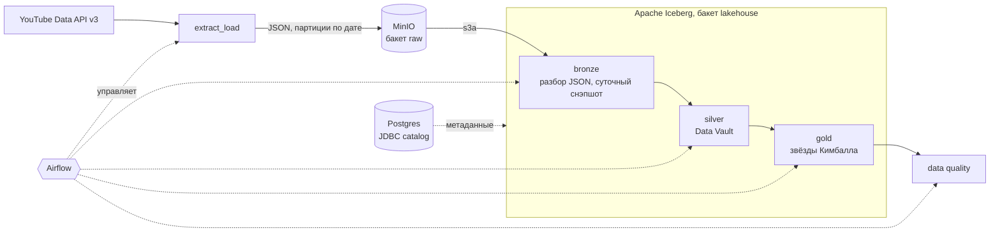

# YouTube Analytics Lakehouse

ETL-пайплайн: YouTube Data API v3 -> MinIO -> лейкхаус на Apache Iceberg (Medallion). Оркестрация Airflow.
Silver-слой смоделирован по **Data Vault**, gold - по **Кимбаллу**, инкремент обеспечивается watermark'ом по времени обработки (`processed_dttm`).

Все модельные данные хранятся в MinIO. Каталог таблиц в **Iceberg JDBC catalog**. Метаданные в Postgres.

## Задача

Собрать модель данных по двум сущностям: канал и видео.
Источник - YouTube API.

Три требования к архитектуре:

- API не хранит историю, снэпшот берётся целиком за сутки и копится как time-series: история строится последовательной ежедневной выгрузкой;
- повторный прогон за ту же дату не должен плодить дубли;
- квота API - 10k units в сутки; на текущем объёме не принципиально, но запросы всё равно написаны с целью максимальной экономии.

## Архитектура



Данные и метаданные разведены: файлы таблиц лежат в MinIO по пути `s3a://$S3_BUCKET_WAREHOUSE/<слой>/<таблица>/`, указатель на актуальную версию в Postgres.

Сырьё складывается в отдельный бакет:

```
s3a://$S3_BUCKET_RAW/youtube/videos/ingestion_date=YYYY-MM-DD/channel_id=<id>/video_YYYY-MM-DD.json
s3a://$S3_BUCKET_RAW/youtube/channels/ingestion_date=YYYY-MM-DD/channel_id=<id>/channel_YYYY-MM-DD.json
s3a://$S3_BUCKET_RAW/youtube/categories/ingestion_date=YYYY-MM-DD/category_YYYY-MM-DD.json
```

## Модель данных

17 таблиц, каждую пишет ровно один пайплайн.

Масштаб на момент написания: 2 канала, 4438 видео, 5 суточных снэпшотов, ~22k строк в таблице фактов по сущности "видео".

### bronze - raw JSON, разобранный в типизированные таблицы

`categories`, `channels`, `videos`. Партиция по `calendar_dt`, запись через `MERGE` по `(id, calendar_dt)` обеспечивает отсутствие дублей при повторных прогонах за одну дату.

### silver - Data Vault 2.0

| тип | таблицы | назначение |
|---|---|---|
| хабы | `h_channel`, `h_video` | бизнес-ключи и момент создания сущности |
| линк | `l_video_channel` | связь между видео и каналом |
| сателлиты атрибутов | `s_channel`, `s_video` | описательные поля, **SCD2** |
| сателлиты по метрикам | `s_channel_stats`, `s_video_stats` | счётчики по дням, **SCD1** |
| справочник | `ref_category` | категории видео |

Разделение атрибутов и метрик: у метрик своя частота изменения (каждый день), у названий и описаний своя (редко). В одной таблице SCD2 они бы плодили версию на каждый снэпшот.

### gold - многомерное моделирование по Кимбаллу

| таблица | тип |
|---|---|
| `dim_calendar` | календарь, готовые подписи для отчёта |
| `dim_channel`, `dim_video` | измерения, **SCD2** |
| `dim_category` | измерение без истории: перечень категорий статичен |
| `fct_video_daily`, `fct_channel_daily` | факты, кумулятивы и дельты |

Звезда, а не снежинка: факт ссылается на каждое измерение напрямую, поэтому от него до любого атрибута ровно один join. `dim_video` хранит `category_name` рядом с `category_id` - в колоночном формате повторяющаяся строка стоит долю байта на запись (замер: +3 KB на 8357 строк), а джойн за названием категории пришлось бы писать в каждом запросе.

Атрибуты канала в `dim_video` при этом **не** денормализованы, только `channel_id`: канал живёт своей историей, и его переименование иначе породило бы новую версию у каждого его видео.

## Запуск

### Требования

Python 3.11, [uv](https://docs.astral.sh/uv/), Docker, JDK 11/17 (для PySpark), GNU Make.

### Настройка

```bash
uv sync --all-groups
source .venv/bin/activate
cp .env.example .env # ключ YouTube API, креды MinIO и каталога
```

### Прогон с нуля

```bash
make infra-up # MinIO и каталог таблиц
python -m extract_load.run # выгрузка за сутки в raw
python -m dataplatform run-all # bronze -> silver -> gold
make dq # проверки качества
```

Бакеты создаёт compose, таблицы и namespace'ы заводятся при первой записи - отдельного шага инициализации нет.

### Оркестрация

```bash
make airflow-up # UI: http://localhost:8081, airflow / airflow
```

`make` определяет `PROJECT_DIR` от корня репозитория и передаёт его в compose.

## CLI

Порядок выполнения не задан списком: каждый пайплайн объявляет свои `inputs` и `outputs`, граф выводится из того, **кто пишет читаемую таблицу**, а порядок даёт топологическая сортировка.

```bash
python -m dataplatform list # план в порядке зависимостей
python -m dataplatform run-all --date YYYY-MM-DD # по умолчанию сегодня
python -m dataplatform run-layer silver
python -m dataplatform run gold.fct_video_daily --with-deps
python -m dataplatform run-all --dry-run # план без запуска Spark
```

`run-all` прогоняет все пайплайны в рамках одной сессии Spark.

## Инкремент

`Slicer` + `SliceRegistry`: пайплайн читает не всю входную таблицу, а срез по watermark (`processed_dttm`), после чтения двигает отметку. Реестр - JSON-файл с блокировкой через `fcntl`, отметка продвигается только вперёд.

Загрузчики вынесены в переиспользуемые классы:

- `SCD1Loader` - режимы `insert` / `upsert` / `rewrite`, `MERGE` обновляет только реально изменившиеся строки;
- `SCD2Loader` - версионирование с тремя режимами пересборки истории; внутри схлопывает неизменившиеся версии по hashdiff (`collapse`).

## Data quality

```bash
python -m dataplatform dq # все 17 таблиц
python -m dataplatform dq gold.fct_video_daily # выборочно
```

Шесть видов проверок:

| проверка | к чему применяется |
|---|---|
| `not_empty` | ко всем |
| `no_duplicates` | по объявленному ключу |
| `no_nulls_in_key` | по объявленному ключу |
| `no_negative` | к счётчикам |
| `single_open_version` | к SCD2-таблицам: ровно одна открытая версия на ключ |
| `no_orphans` | ссылочная целостность: сателлиты -> хабы, факты -> измерения, измерения -> измерения |

Всего 75 проверок на 17 таблицах. Принцип - **warn, not error**: команда печатает нарушения и всегда завершается нулём, поэтому упавшая проверка не роняет сборку.

## Airflow

Два DAG'а, связанные через **Asset**:

```
youtube_stat:     extract -> bronze -> silver -> gold --+
                                                        | produces asset
youtube_stat_dq:                                        +--> dq
```

Airflow-таск `gold` объявляет `outlets=[LAKEHOUSE]`, DQ-DAG объявляет `schedule=[LAKEHOUSE]`. Ассет производится только при успешном завершении, поэтому проверки запускаются строго после удачной сборки и никогда - после упавшей. Ни один DAG не знает про существование другого: связь идёт через имя ассета.

## Почему так

| решение | почему так |
|---|---|
| Iceberg | ACID, эволюция схемы, скрытое партиционирование, time travel |
| JDBC-каталог на Postgres, а не `HadoopCatalog` | `HadoopCatalog` ищет актуальную версию таблицы листингом директории и коммитит переименованием файла, а на объектном хранилище rename - это copy+delete, атомарности нет. JDBC-каталог делает коммит транзакцией в базе, поэтому warehouse можно держать целиком в MinIO |
| Data Vault в silver | источник меняет схему и состав полей, DV принимает изменения без переписывания истории |
| DV без `record_source` и хеш-ключей хабов | источник один, а идентификаторы YouTube глобально уникальны: `record_source` и хеш-ключ хаба в данном случае избыточны |
| Кимбалл в gold | silver уже нормализован до предела: DV защищает согласованность при загрузке, gold модель по звезде обеспечивает простой доступ к необходимым данным |
| отсутствие суррогатных ключей | осознанное отклонение от стандарта. Источник один, `video_id` и `channel_id` в нём уникальны, поэтому суррогат не решал бы ни коллизий между источниками, ни подмены нестабильного идентификатора. Вернуться к суррогатам придётся при появлении второго источника тех же сущностей |
| граф зависимостей из таблиц | выведенный граф при ошибке падает с исключением; ручной порядок может оказаться неправильным и пайплайны будут молча работать в неверном порядке |

## Ограничения

**Исторический снэпшот невозможен** - это ограничение источника. API отдаёт метрики только на "сейчас", поэтому прогон за прошлую дату записал бы сегодняшние цифры под старой меткой. Extract идемпотентен по дате и корректно переигрывает сегодняшний прогон, но прошлое не восстанавливает.

**Отрицательные дельты - норма.** Счётчики YouTube немонотонны: площадка списывает накрученные просмотры. Поэтому `sum(delta) = last - first`, а не `max - min`, и дельты исключены из проверки на отрицательные значения.

**`favorites_cnt` всегда ноль.** YouTube не пишет ничего в `favoriteCount` и отдаёт в нём нули. Мера проходит через все слои как есть - выкидывать поле источника означает расходиться с ним по составу.

## Тесты

```bash
make test
```

287 тестов, ~0.7 секунды, **без Spark и поднятой инфраструктуры**. Проверяются не значения, а согласованность деклараций с кодом: разбором AST достаётся список таблиц, которые пайплайн реально читает и пишет, и сверяется с его `inputs`/`outputs` в реестре; из `create table` вытаскиваются колонки и сверяются с тем, что объявил DQ. Плюс инварианты формы - у пайплайна ровно одна функция `run`, `slicer.commit()` не вложен в условие и стоит последним.

## Структура

```
extract_load/      ingest - извлечение из API и запись сырья в MinIO
  docker-compose.yml  MinIO и Postgres под каталог таблиц
dataplatform/
  etl_tools/       загрузчики SCD1/SCD2, слайсер, collapse
  pipelines/       17 пайплайнов: bronze, silver, gold
  registry.py      декларации пайплайнов и граф зависимостей
  quality.py       проверки качества данных
  __main__.py      CLI
airflow/           образ, compose и DAG'и
tests/             структурные тесты
```
